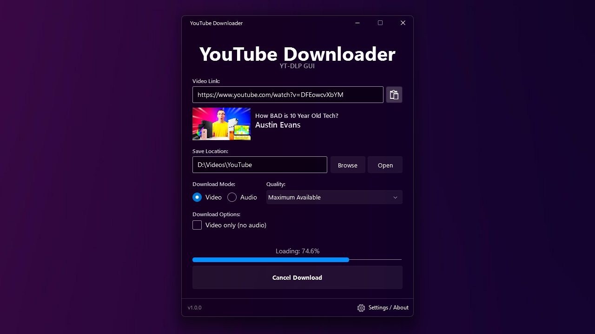
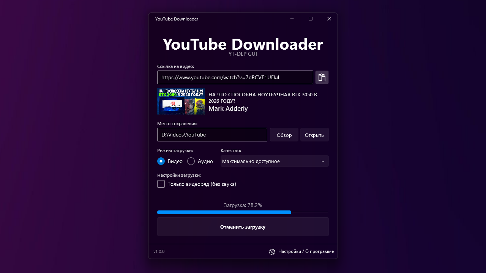
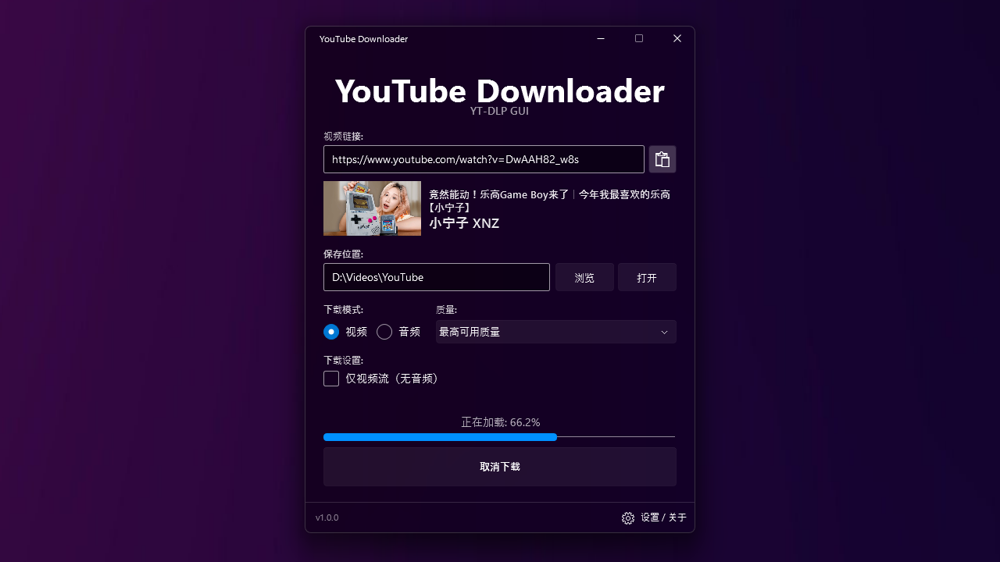
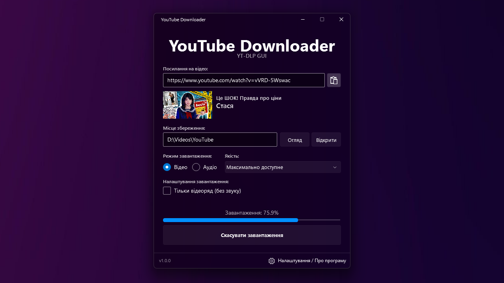
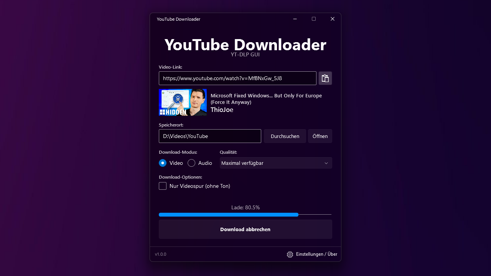
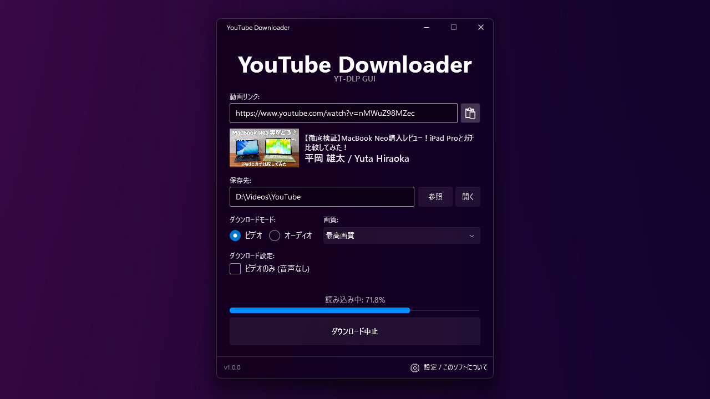
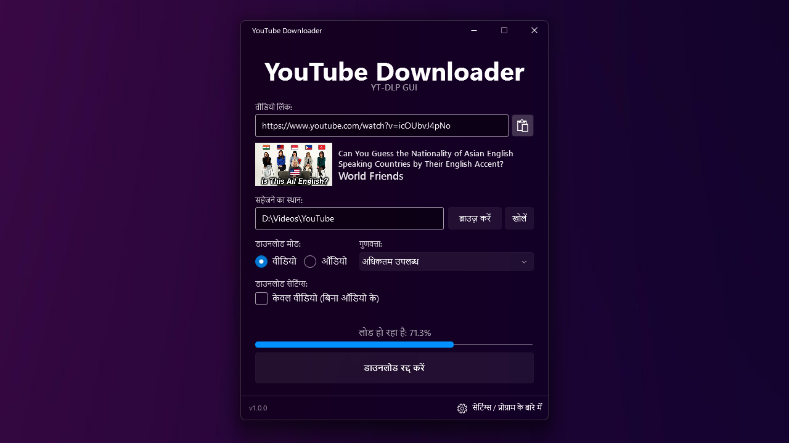
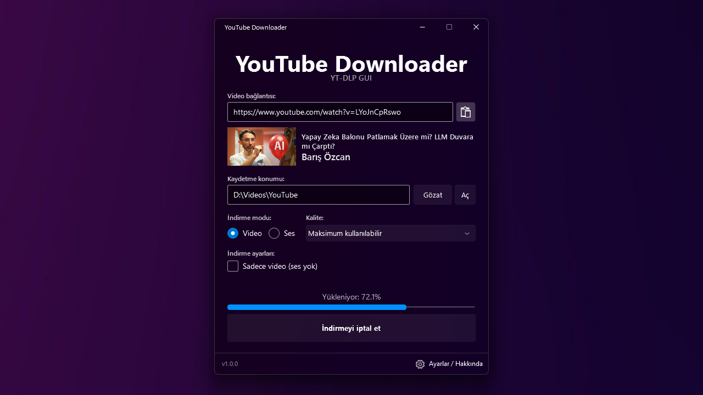
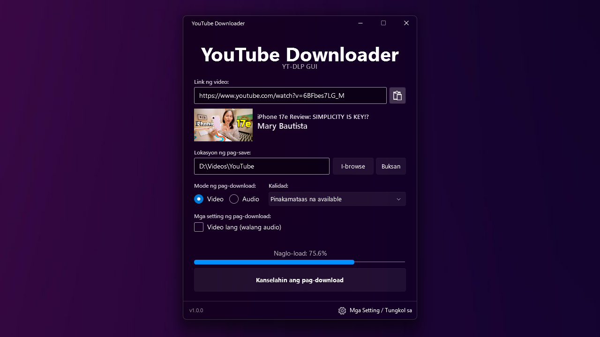

# YouTube Downloader GUI

**The Best YouTube Video Downloader.**
A beautiful and user-friendly GUI implementation of yt-dlp, featuring a sleek preview of the video being downloaded. With its clean design and no unnecessary features, you can download your favorite videos quickly and efficiently - without wasting time. Translations into the world's most popular languages ​​ensure accessibility for the widest possible user base.

### Technical Details
* Based on **yt-dlp**: [github.com/yt-dlp/yt-dlp](https://github.com/yt-dlp/yt-dlp)
* Uses **ffmpeg** libraries (must be located inside the application folder).
* Developed in **Visual Studio 2026**.
* Powered by **.NET Core 8.0**.
* Open source for the community.

---

## 🇷🇺 Russian (Русский) 
**Лучший загрузчик видео с YouTube.**

Красивая и удобная реализация графического интерфейса (GUI) для yt-dlp с элегантным предпросмотром загружаемого видео. Благодаря лаконичному дизайну и отсутствию лишних функций вы сможете скачивать любимые видео быстро и эффективно, не теряя времени. Перевод на самые популярные языки мира обеспечивает доступность для максимально широкого круга пользователей.

### Технические подробности
* Основан на **yt-dlp**: [github.com/yt-dlp/yt-dlp](https://github.com/yt-dlp/yt-dlp)
* Использует библиотеки **ffmpeg**, которые должны лежать внутри папки с программой.
* Проект разработан в **Visual Studio 2026**.
* Работает на платформе **.NET Core 8.0**.
* Открытый исходный код для сообщества.

---

## Language Selection / Выбор языка / 语言

<b>🇨🇳 Chinese (简体中文)</b>

**优秀的 YouTube 视频下载器**
一个美观且用户友好的 yt-dlp 图形界面 (GUI) 实现，具有正在下载视频的精美预览功能。 凭借其整洁的设计 и 精简的功能，您可以快速高效地下载喜爱的视频，无需浪费时间。

### 技术细节
* 基于 **yt-dlp**: [github.com/yt-dlp/yt-dlp](https://github.com/yt-dlp/yt-dlp)
* 使用 **ffmpeg** 库（必须位于程序文件夹内）。
* 在 **Visual Studio 2026** 中开发。
* 运行于 **.NET Core 8.0** 平台。
* 对社区开放源代码。

<b>🇺🇦 Ukrainian (Українська)</b>

**Найкращий завантажувач відео з YouTube.**
Красива та зручна реалізація графічного інтерфейсу (GUI) для yt-dlp з елегантним попереднім переглядом відео, що завантажується. Лаконічний дизайн та швидка робота.

### Технічні подробиці
* Основано на **yt-dlp**: [github.com/yt-dlp/yt-dlp](https://github.com/yt-dlp/yt-dlp)
* Використовує бібліотеки **ffmpeg**, які мають знаходитися всередині папки з програмою.
* Проєкт розроблено у **Visual Studio 2026**.
* Працює на платформі **.NET Core 8.0**.
* Відкритий вихідний код для спільноти.

<b>🇪🇸 Spanish (Español)</b>

**El mejor descargador de videos de YouTube.**
Una implementación de interfaz gráfica (GUI) de yt-dlp, hermosa y fácil de usar, que incluye una vista previa elegante del video en descarga. Con su diseño limpio и sin funciones innecesarias, puedes descargar tus videos favoritos de manera rápida и eficiente, sin perder el tiempo.

### Detalles Técnicos
* Basado en **yt-dlp**: [github.com/yt-dlp/yt-dlp](https://github.com/yt-dlp/yt-dlp)
* Utiliza librerías **ffmpeg** (deben estar dentro de la carpeta del programa).
* Proyecto desarrollado en **Visual Studio 2026**.
* Funciona en la plataforma **.NET Core 8.0**.
* Código fuente abierto para la comunidad.

<b>🇩🇪 German (Deutsch)</b>

**Der beste YouTube-Video-Downloader.**
Eine wunderschöne und benutzerfreundliche GUI-Implementierung von yt-dlp mit einer eleganten Vorschau des heruntergeladenen Videos. Mit seinem klaren Design и ohne unnötige Funktionen können Sie Ihre Lieblingsvideos schnell und effizient herunterladen.

### Technische Details
* Basierend auf **yt-dlp**: [github.com/yt-dlp/yt-dlp](https://github.com/yt-dlp/yt-dlp)
* Verwendet **ffmpeg**-Bibliotheken (müssen sich im Programmordner befinden).
* Projekt entwickelt in **Visual Studio 2026**.
* Läuft auf der **.NET Core 8.0** Plattform.
* Open Source für die Community.

<b>🇯🇵 Japanese (日本語)</b>

**最高のYouTubeビデオダウンローダー**
美しく使いやすいyt-dlpのGUI実装。ダウンロード中のビデオをスマートにプレビューできます。洗練されたデザインと無駄のない機能により、時間を無駄にすることなく、お気に入りのビデオを迅速かつ効率的にダウンロードできます。

### 技術的な詳細
* **yt-dlp** ベース: [github.com/yt-dlp/yt-dlp](https://github.com/yt-dlp/yt-dlp)
* **ffmpeg** ライブラリを使用（プログラムフォルダ内に配置する必要があります）。
* **Visual Studio 2026** で開発。
* **.NET Core 8.0** プラットフォームで動作。
* コミュニティ向けのオープンソース。

<b>🇮🇳 Hindi (हिन्दी)</b>

**सबसे अच्छा YouTube वीडियो डाउनलोडर।**
yt-dlp का एक सुंदर और उपयोगकर्ता के अनुकूल GUI कार्यान्वयन, जिसमें डाउनलोड किए जा रहे वीडियो का एक शानदार पूर्वावलोकन (preview) है। इसके स्पष्ट डिज़ाइन и बिना किसी अनावश्यक सुविधाओं के, आप अपने पसंदीदा वीडियो को जल्दी и कुशलता से डाउनलोड कर सकते हैं।

### तकनीकी विवरण
* **yt-dlp** पर आधारित: [github.com/yt-dlp/yt-dlp](https://github.com/yt-dlp/yt-dlp)
* **ffmpeg** लाइब्रेरी का उपयोग करता है (प्रोग्राम फ़ोल्डर के अंदर होना चाहिए)।
* **Visual Studio 2026** में विकसित।
* **.NET Core 8.0** प्लेटफॉर्म पर चलता है।
* समुदाय के लिए ओपन सोर्स।

<b>🇹🇷 Turkish (Türkçe)</b>

**En İyi YouTube Video İndirici.**
İndirilen videonun şık bir önizlemesini sunan, yt-dlp'nin güzel ve kullanıcı dostu bir GUI uygulaması. Sade tasarımı и gereksiz özelliklerden arındırılmış yapısı sayesinde, en sevdiğiniz videoları zaman kaybetmeden hızlı ve verimli bir şekilde indirebilirsiniz.

### Teknik Detaylar
* **yt-dlp** tabanlı: [github.com/yt-dlp/yt-dlp](https://github.com/yt-dlp/yt-dlp)
* **ffmpeg** kitaplıklarını kullanır (program klasörünün içinde olmalıdır).
* **Visual Studio 2026**'da geliştirildi.
* **.NET Core 8.0** platformunda çalışır.
* Topluluk için açık kaynak kodlu.

<b>🇵🇭 Tagalog (Filipino)</b>

**Ang Pinakamahusay na YouTube Video Downloader.**
Isang maganda и user-friendly na GUI implementation ng yt-dlp. Mabilis и mahusay na pag-download ng iyong mga paboritong video nang hindi nagsasayang ng oras.

### Mga Teknikal na Detalye
* Nakabase sa **yt-dlp**: [github.com/yt-dlp/yt-dlp](https://github.com/yt-dlp/yt-dlp)
* Gumagamit ng **ffmpeg** libraries (dapat nasa loob ng program folder).
* Dinevelop sa **Visual Studio 2026**.
* Tumatakbo sa **.NET Core 8.0** platform.
* Open source para sa komunidad.

---
